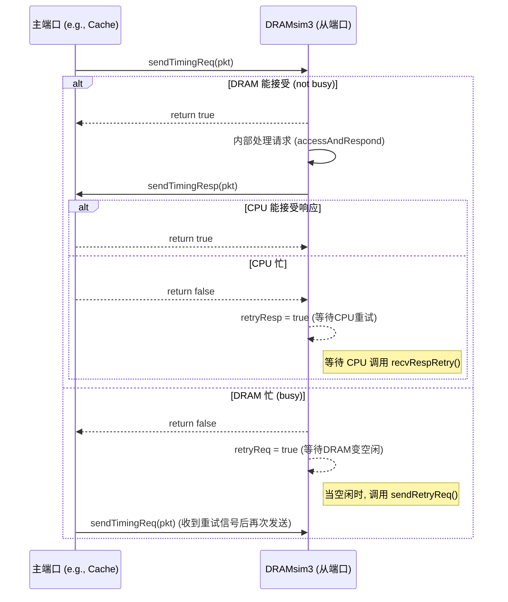

# 自定义网络加速器模拟器设计文档

本文档旨在为构建一个高性能、可扩展的网络加速器模拟器提供设计思路与核心组件实现方案。项目初期将重点重构一个受 gem5 启发的、高效的事件驱动核心。

## 第一章 C++ 核心技术回顾

本章回顾了在构建模拟器时会频繁使用的 C++ 核心特性，奠定坚实的编程基础。
### 1.1 C++ 核心特性
1. **`auto` 自动类型推导**
    - **作用**：让编译器自动推断变量类型，减少冗长的类型声明。
    - **常见场景**：遍历容器（如 `std::vector`、`std::map`）、接收函数返回值（如迭代器、Lambda）。
    - **示例**：
        ```C++
        std::vector<int> v = {1, 2, 3};
        for (auto it = v.begin(); it != v.end(); ++it) {
            std::cout << *it << std::endl;
        }
        auto x = 3.14; // x 自动推断为 double
        ```
2. **Lambda 表达式（匿名函数）**
    - **作用**：在需要函数的地方，直接定义一个匿名的“小函数”，无需单独声明。
    - **常见场景**：事件回调（如 `EventFunctionWrapper`）、容器算法（如 `std::sort`、`std::for_each`）。
    - **语法**：
        ```C++
        auto f = [](int x) { return x * x; };
        std::cout << f(5) << std::endl; // 输出 25
        ```
    - **项目实际例子（事件系统）**：
        ```C++
        // 定义一个事件，触发时执行 Lambda
        sendResponseEvent([this] { sendResponse(); }, name());
        ```
3. **`std::function` 万能函数封装器**
    - **作用**：可以存储任何“可调用对象”（普通函数、Lambda、成员函数等），实现统一的回调接口。
    - **常见场景**：事件系统的回调、需要灵活传递函数的任何地方。
    - **示例**：
        ```C++
        #include <functional>
        std::function<void(int)> callback;
        callback = [](int x) { std::cout << x << std::endl; };
        callback(42); // 输出 42
        ```
4. **智能指针（`std::unique_ptr`、`std::shared_ptr`）**
    - **作用**：自动管理动态分配的内存，有效防止内存泄漏。
    - **常见场景**：管理动态分配对象的生命周期，如事件、数据包等对象的自动释放。
    - **示例**：
        ```C++
        #include <memory>
        std::unique_ptr<int> p(new int(10));
        std::cout << *p << std::endl; // 输出 10
        // p离开作用域时，其管理的内存会被自动释放
        ```
        
5. **模板与泛型编程**
    - **作用**：让函数和类能够支持多种数据类型，极大提高代码的复用性。
    - **常见场景**：容器类（如 `std::vector<T>`）、通用算法（如 `std::swap<T>`）。
    - **示例**：
        ```C++
        template<typename T>
        T add(T a, T b) { return a + b; }
        std::cout << add(1, 2) << std::endl;       // 输出 3
        std::cout << add(1.5, 2.5) << std::endl; // 输出 4.0
        ```
        
6. **`override` 和 `final` 关键字**
    - **作用**：用于虚函数，增强代码的安全性和可读性。
    - `override`：明确表示该函数重写了基类的虚函数，编译器会检查签名是否一致，防止因拼写错误等导致重写失败。
    - `final`：表示该虚函数不能再被任何派生类重写。
    - **示例**：
        ```C++
        class Base {
        public:
            virtual void foo();
        };
        class Derived : public Base {
        public:
            void foo() override; // 明确告知编译器这是重写
        };
        ```
        
7. **`constexpr` 和 `const` 常量表达式**
    - **作用**：`constexpr` 表示“编译期常量”，其值在编译时就已确定；`const` 表示“只读变量”，其值在运行时初始化后不能再修改。
    - **常见场景**：定义数组大小、常量参数、模板元编程等。
    - **示例**：
        ```C++
        constexpr int N = 8;       // 编译期常量
        const double PI = 3.14159; // 运行时常量
        ```
8. **`using` 和 `typedef` 类型别名**
    - **作用**：为复杂的类型起一个简洁、易读的别名。`using` 是 C++11 推荐的更现代、更灵活的语法。
    - **示例**：
        ```C++
        using PacketPtr = DataPacket*;
        typedef std::vector<int> IntVec;
        ``` 
### 1.2 常用 STL 容器与技巧
9. **常用 STL 容器**   
    - **作用**：提供高效的数据结构来管理数据集合。        
    - `std::unordered_map<K, V>`：哈希表，提供平均 O(1) 复杂度的查找、插入和删除。        
    - `std::queue<T>`：队列，遵循先进先出（FIFO）原则。       
    - `std::deque<T>`：双端队列，允许在队列的两端进行高效的插入和删除。        
    - **示例**： 
        ```C++
        #include <unordered_map>
        std::unordered_map<int, std::string> m;
        m[1] = "hello";
        ```
10. **异常处理（`try`/`catch`/`throw`）**
    - **作用**：提供一种机制来捕获和处理运行时错误，使程序在遇到问题时能够优雅地处理，而不是直接崩溃。
    - **示例**：
        ```C++
        try {
            throw std::runtime_error("出错了！");
        } catch (const std::exception& e) {
            std::cout << e.what() << std::endl;
        }
        ```
11. **友元类与友元函数（`friend`）**
    - **作用**：允许一个类或函数访问另一个类的私有（`private`）和保护（`protected`）成员，打破了封装性，需谨慎使用。
    - **示例**：
        ```C++
        class B;
        class A {
            friend class B; // B 可以访问 A 的私有成员
        private:
            int secret;
        };
        ```
12. **C++11/14/17 新特性（项目常见）**
    - **范围 `for` 循环**：简化容器遍历。
        ```C++
        std::vector<int> v = {1, 2, 3};
        for (auto x : v) {
            std::cout << x << std::endl;
        }
        ```
    - **初始化列表**：提供统一的初始化语法。
        ```C++
        std::vector<int> v{1, 2, 3, 4};
        ```
    - **`nullptr` 替代 `NULL`**：`nullptr` 是具有明确类型的空指针，更安全。
        ```C++
        int* p = nullptr;
        ```
### 1.3 面向对象编程 (OOP)

- **继承**: 允许我们依据一个类来定义另一个类。派生类可以继承基类的所有方法和属性，是实现代码复用和抽象的关键。  
- **多态**: 多态允许我们通过父类指针或引用来调用子类重写的方法，是实现“面向接口编程”的核心。例如，`Simulator* gSim` 指针可以指向一个 `VectorQueue` 实例，当调用 `gSim->runNextEvent()` 时，实际执行的是 `VectorQueue` 中实现的版本。这大大提高了代码的灵活性和可扩展性。
- **函数重载**: 在同一作用域中，可以声明功能类似的同名函数，但其参数列表（个数、类型或顺序）必须不同。
    ```C++
    class PrintData {
    public:
        void print(int i) {
            cout << "整数为：" << i << endl;
        }
    
        void print(double f) {
            cout << "浮点数为：" << f << endl;
        }
    
        void print(char c[]) {
            cout << "字符串为：" << c << endl;
        }
    };
    ```
- **运算符重载**: 允许为自定义类型（如 `Box`）赋予标准运算符（如 `+`）新的含义，使代码更直观。
    ```
    // 声明一个全局的 operator+ 函数
    Box operator+(const Box&, const Box&);
    
    // 或者作为成员函数重载
    class Box {
        // ...
    public:
        Box operator+(const Box& b) {
            Box box;
            box.length = this->length + b.length;
            box.breadth = this->breadth + b.breadth;
            box.height = this->height + b.height;
            return box;
        }
    };
    ```
    

### 1.2 现代 C++ 特性

- **`auto` 关键字**: 用于自动类型推导，可以代替冗长复杂的变量声明，使代码更简洁，尤其适用于迭代器和 Lambda 表达式。
    
- **Lambda 表达式**: C++11 引入的匿名函数，可以方便地在需要的地方定义和使用，无需预先命名。
    
    ```
    // 定义一个lambda，计算 x 的平方
    auto f = [](int x) { return x * x; };
    int y = f(5); // y 的值为 25
    ```
    
- **`std::function`**: 一个通用的函数封装器，可以存储任何可调用对象（普通函数、Lambda、成员函数等），实现统一的调用接口。
    
    ```
    #include <functional>
    #include <iostream>
    
    int foo(int x) { return x + 1; }
    
    int main() {
        // 定义一个可调用对象 f，接受 int 参数，返回 int
        std::function<int(int)> f;
    
        // 赋值为 Lambda 表达式
        f = [](int x) { return x * 2; };
        std::cout << f(10) << std::endl; // 输出 20
    
        // 赋值为普通函数
        f = foo;
        std::cout << f(10) << std::endl; // 输出 11
        return 0;
    }
    ```
    

### 1.3 常用标准库

- **`std::vector`**: 动态数组容器，提供了方便的元素管理接口。
    
    - 创建: `std::vector<int> myVector;` 或 `std::vector<int> myVector(5);`
        
    - 添加元素: `myVector.push_back(7);`
        
    - 获取大小: `myVector.size();`
        
    - 删除元素: `myVector.erase(myVector.begin() + index);`
        
    - 清空: `myVector.clear();`
        
- **`inline` 关键字**: 建议编译器在调用处展开函数代码，以减少短小、频繁调用的函数所带来的开销。注意这只是一个建议，编译器可以自行决定是否采纳。
## 第二章 事件驱动核心架构
### 2.1 事件系统核心实现 
#### 2.1.1 事件对象 (Event)
- **设计理念**: 事件对象 (Event) 是所有“未来要发生的动作”的抽象。每个事件都包含触发时间、优先级、回调逻辑等信息。
- **接口设计**:
    - `virtual void process() = 0;` —— 纯虚函数，所有事件必须实现自己的处理逻辑。
    - `Tick when() const;` —— 获取事件的触发时间。
    - `Priority priority() const;` —— 获取事件优先级。
    - `bool scheduled() const;` —— 查询事件是否已被调度。
- **扩展实现**:
    - `EventFunctionWrapper`：允许用 `std::function` 封装任意回调，极大提升灵活性，便于将 Lambda、成员函数等作为事件处理逻辑。
#### 2.1.2 事件队列 (EventQueue)
- **设计理念**: 事件队列负责管理所有待处理事件，保证事件按时间和优先级顺序依次执行。
- **接口设计**:
    - `void schedule(Event *event, Tick when);` —— 调度事件。
    - `void deschedule(Event *event);` —— 取消事件。
    - `void reschedule(Event *event, Tick when);` —— 重新调度事件。
    - `Event *serviceOne();` —— 取出并执行下一个事件。
    - `void serviceEvents(Tick when);` —— 执行直到指定时间的所有事件。
        
- **实现要点**:
    - 内部采用链表或优先队列结构，保证事件排序。
    - 支持事件唯一性检查，防止重复调度。
    - 提供全局 `curTick()`，便于获取当前仿真时间。
#### 2.1.3 事件管理器 (EventManager)
- **设计理念**: 为每个仿真对象提供事件调度能力，便于对象内部管理自己的事件。
- **接口设计**:
    - `void schedule(Event &event, Tick when);`
    - `void deschedule(Event &event);`
    - `void reschedule(Event &event, Tick when, bool always = false);`
- **实现要点**:
    - 默认使用全局事件队列 `gSim`，也可扩展为多队列支持多线程仿真。
## 第三章 模块间通信：端口 (Port) 机制
### 3.1 端口基类与主从端口 (@port.h @port.cpp)
#### 3.1.1 端口基类 (Port)
- **设计理念**: 端口是模块间通信的抽象接口，支持灵活的绑定、解绑和状态查询。
- **接口设计**:
    - `void bind(Port &peer);` —— 绑定另一个端口。
    - `void unbind();` —— 解绑。
    - `bool isConnected() const;` —— 查询连接状态。
    - `const std::string name() const;` —— 获取端口名。
- **实现要点**:
    - 每个端口持有对等端口的指针 `_peer`，并维护连接状态 `_connected`。
    - 支持异常处理（如未绑定端口时抛出异常或打印警告）。
#### 3.1.2 主从端口 (RequestPort/ResponsePort)
- **RequestPort (主端口)**:
    - 负责发起请求（如 CPU、DMA）。
    - 通过 `sendTimingReq(PacketPtr pkt)` 发送时序请求。
    - 支持流控和重试机制 (`recvReqRetry()`)。
- **ResponsePort (从端口)**:
    - 负责接收请求并发送响应（如 Cache、内存）。
    - 通过 `recvTimingReq(PacketPtr pkt)` 接收请求。
    - 通过 `sendTimingResp(PacketPtr pkt)` 发送响应。
    - 支持流控和重试机制 (`recvRespRetry()`)。
- **实现要点**:
    - 主从端口通过 `bind/unbind` 互相连接，形成一对一通信关系。
    - 支持默认端口 (`DefaultRequestPort/DefaultResponsePort`)，便于未绑定时的异常处理。
    - 支持流控、重试、窥探等高级协议。
#### 3.1.3 通信协议 (@timing.h @timing.cpp)
- **TimingRequestProtocol / TimingResponseProtocol**:
    - 定义了标准的时序请求-响应接口，支持复杂的流控和重试机制。
- **关键接口**:
    - `bool sendReq(TimingResponseProtocol *peer, PacketPtr pkt);`
    - `bool sendResp(TimingRequestProtocol *peer, PacketPtr pkt);`
    - `void sendRetryReq(TimingRequestProtocol *peer);`
    - `void sendRetryResp(TimingResponseProtocol *peer);`
    - `virtual bool recvTimingReq(PacketPtr pkt) = 0;`
    - `virtual bool recvTimingResp(PacketPtr pkt) = 0;`
    - `virtual void recvReqRetry() = 0;`
    - `virtual void recvRespRetry() = 0;`
- **实现要点**:
    - 采用虚函数和友元类机制，保证协议的灵活性和可扩展性。
    - 支持主从端口间的双向流控和重试，适用于复杂的总线和内存场景。
## 第四章 仿真对象与数据包机制
### 4.1 仿真对象基类 (@object.h @object.cpp)
- **SimObject**: 所有仿真模块的基类，提供统一的生命周期管理和端口管理接口。
- **关键接口**:
    - `virtual void init();` —— 初始化。
    - `virtual void regProbePoints();` —— 注册探针点。
    - `virtual void regProbeListeners();` —— 注册探针监听器。
    - `virtual Port &getPort(const std::string &if_name, int idx = -1);` —— 获取端口。
    - `virtual void startup();` —— 启动。
- **对象管理**:
    - 维护全局对象列表 `SimObjectList`，便于通过名字查找对象。
    - 支持名字解析器 `SimObjectResolver`，便于模块间解耦。
### 4.2 数据包机制 (@packet.h)
- **DataPacket/PacketPtr**: 模块间通信的数据载体，封装了地址、数据、读写类型等信息。
- **关键接口**:
    - `addr_t getAddr() const;`
    - `bool isRead() const;`
    - `bool isWrite() const;`
    - `void setData(const std::vector<uint32_t>& d);`
- **PacketQueue/PacketManager**:
    - 提供数据包的批量创建、释放、队列管理等功能。
    - 支持读写包的快速生成和回收，便于高效模拟大规模数据流。
- **与 gem5 对比**:
    - 结构简洁，接口清晰，便于后续扩展更多元数据（如标志位、事务ID等）。
## 第五章 端口与事件系统协同案例
### 5.1 端口-事件协同机制
- **典型流程**:
    1. 主端口（如 CPU）通过 `sendTimingReq(pkt)` 发起请求。
    2. 从端口（如 DRAM）通过 `recvTimingReq(pkt)` 接收请求，若忙则返回 `false` 并置位 `retryReq`。
    3. 当从端口空闲时，调用 `sendRetryReq()` 通知主端口重试。
    4. 响应流程同理，支持 `sendTimingResp(pkt)`、`recvRespRetry()` 等机制。
- **事件驱动**:
    - 所有端口操作均可通过事件系统调度，保证仿真时间的精确推进和模块间的异步解耦。
### 5.2 代码示例与流程图

**交互流程图:**


###  5.3gem5 端口主从交互模式简述
- 主端口（RequestPort）：发起请求（如 CPU、DMA）。
- 从端口（ResponsePort）：接收请求、发送响应（如 Cache、Memory）。
- 交互流程（以 Timing 模式为例）：
1. 主端口调用 *sendTimingReq(pkt)*，底层会调用从端口的 **recvTimingReq(pkt)**。
2. *recvTimingReq(pkt)* 返回 true 表示接受，false 表示忙（不能接受）。
3. 如果返回 false，主端口必须等待从端口稍后调用 sendRetryReq()，主端口收到后再重试。
4. 响应流程类似：从端口用 **sendTimingResp(pkt)**，主端口用 `recvTimingResp(PacketPtr)`，如果主端口忙，则从端口等待主端口调用`sendRetryResp()`。
